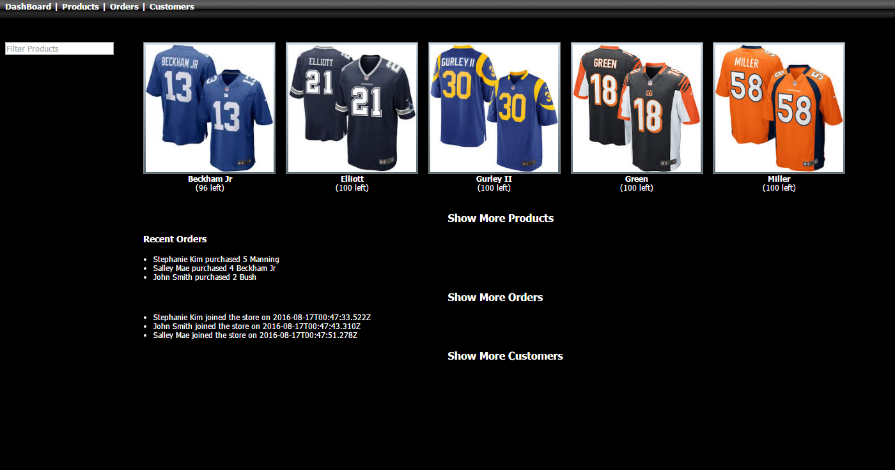
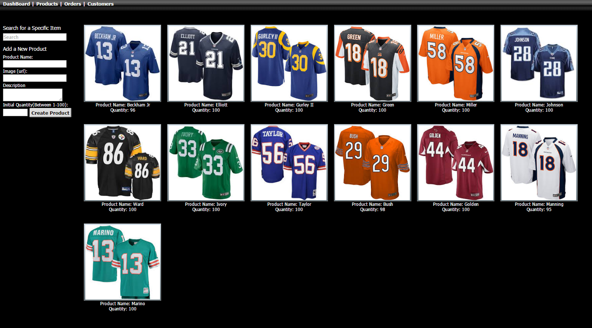
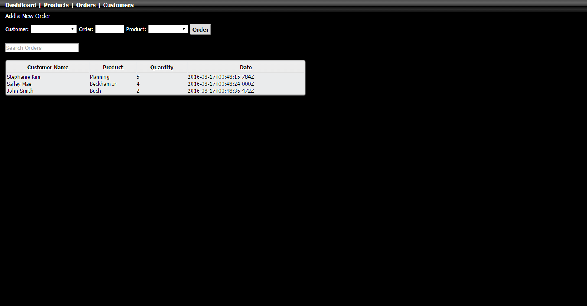

# Mean Store
### A simple online web store that users can add products, make orders, and add customers. 

## Features
* Create products that include the name, image, and quantity of the product
* Create orders that include the name of the person who wishes to make the order and what product and how much of the product they want to order
* Create customers
* Dashboard showing most recent products, orders, and new customers who have joined the store
* Filter of products, orders, and customers
* Include quantity for products and update quantities as customers make an order for that product
* Restful Routes

## Technologies Utilized 
* MongoDB
* Express.js
* Angular.js
* Node.js
* AWS
* Nginx

